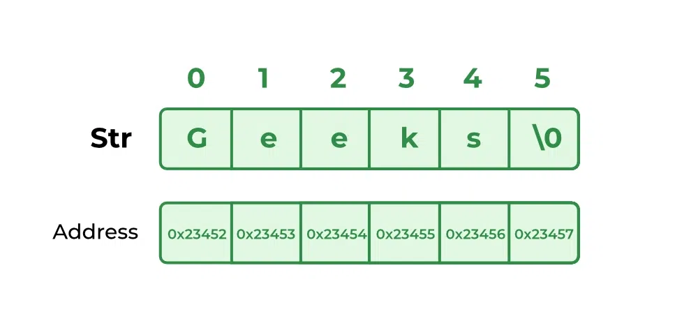

[**🏠 Home**](../README.md) | [**Functions and Modular Programming ◀️**](../04_Functions_and_modular_programming/functions_and_modular_programming.md) | [**Pointers ▶️**](../06_Pointers/pointers.md)


- ### [**05: Arrays and Strings**](#05-arrays-and-strings-1)

    - [**Arrays**](#arrays)
        - Single and multi-dimensional arrays
        - Array manipulation (insertion, deletion, traversal)
    - [**Strings**](#strings)
        - String basics
        - String manipulation
        - String handling functions


# **05: Arrays and Strings**

Arrays and strings are fundamental data structures in C programming. This tutorial will cover the key concepts and operations related to arrays and strings in C.

## **Arrays**

Arrays are collections of elements of the same data type. They allow you to store and manipulate multiple values efficiently.

Here are some characteristics of C arrays:

- **Fixed Size**: Once the size of an array is defined, it cannot be changed.
- **Single Type**: All elements in an array must be of the same type.
- **Ordered**: Elements are stored in contiguous memory locations and can be accessed using an index.
- **Zero-indexed**: Array indices start from 0.

### Single-Dimensional Arrays

Declaring and initializing a single-dimensional array:

```c
data_type array_name[size];
data_type array_name[size] = {value1, value2, ..., valueN};
```

Example: [example_array.c](./src/example_array.c)

```c
#include <stdio.h>

int main() {
    int numbers[5] = {1, 2, 3, 4, 5};
    printf("Element at index 2: %d\n", numbers[2]);
    return 0;
}
```

### Multi-Dimensional Arrays

Declaring and initializing a multi-dimensional array:

```c
data_type array_name[rows][cols];
data_type array_name[rows][cols] = {{value11, value12, ..., value1c}, {value21, value22, ..., value2c}, ..., {valuer1, valuer2, ..., valuerc}};
```

Example: [example_multidimension_array.c](./src/example_multidimension_array.c)

```c
#include <stdio.h>

int main() {
    int matrix[2][3] = {{1, 2, 3}, {4, 5, 6}};
    printf("Element at (1, 2): %d\n", matrix[1][2]);
    return 0;
}
```

### Array Manipulation

1. **Traversal**:
   ```c
   for (int i = 0; i < size; i++) {
       printf("%d ", array[i]);
   }
   ```

2. **Insertion**:
   ```c
   array[index] = new_value;
   ```

3. **Deletion**:
   ```c
   for (int i = index; i < size - 1; i++) {
       array[i] = array[i + 1];
   }
   size--;
   ```

Example: [example_array_manipulation.c](./src/example_array_manipulation.c)

```c
#include <stdio.h>

int main() {
    int numbers[5] = {1, 2, 3, 4, 5};
    int size = 5;

    printf("Original array: ");
    for (int i = 0; i < size; i++) {
        printf("%d ", numbers[i]);
    }
    printf("\n");

    // Insert a new element at index 2
    numbers[2] = 10;
    printf("Array after insertion: ");
    for (int i = 0; i < size; i++) {
        printf("%d ", numbers[i]);
    }
    printf("\n");

    // Delete the element at index 1
    for (int i = 1; i < size - 1; i++) {
        numbers[i] = numbers[i + 1];
    }
    size--;
    printf("Array after deletion: ");
    for (int i = 0; i < size; i++) {
        printf("%d ", numbers[i]);
    }
    printf("\n");

    return 0;
}
```


## **Strings**

In C, strings are represented as null-terminated character arrays. They provide various functions for string manipulation.

Here are some characteristics of C strings:

- **No Built-in String Type**: C does not have a built-in string type. Instead, strings are typically implemented as arrays of characters.
- **Null-terminated**: C strings are terminated by the null character ('\0'). The null character is not part of the string itself, but it signals the end of the string.
- **Single Byte Characters**: Each character in a C string occupies a single byte of memory.
- **Modifiable**: C strings are mutable, meaning you can change their contents.
<br/><br/>
 

Image source: https://www.geeksforgeeks.org/strings-in-c/

### String Basics

There are several ways to declare and initialize strings in C:

Declaring a string without initialization:
```c
char string_name[size];
```

Initializing a string with a string literal:
```c
char string_name[] = "string_literal";
```

Initializing a string with individual characters:
```c
char string_name[] = {'c', 'h', 'a', 'r', 's', '\0'};
```

Initializing a string with a single character:
```c
char string_name[size] = {[0 ... size-2] = 'a', [size-1] = '\0'};
```

### String Manipulation

1. **Accessing individual characters**:
   ```c
   char c = str[index];
   ```

2. **Modifying individual characters**:
   ```c
   str[index] = 'new_char';
   ```

3. **Inserting a character**:
   ```c
   for (int i = strlen(str); i > index; i--) {
       str[i] = str[i - 1];
   }
   str[index] = 'new_char';
   ```

4. **Deleting a character**:
   ```c
   for (int i = index; i < strlen(str); i++) {
       str[i] = str[i + 1];
   }
   ```

Example: [examples_string_manipulation.c](./src/examples_string_manipulation.c)

```c
#include <stdio.h>
#include <string.h>

int main() {
    char str[20] = "Hello, world!";
    printf("Original string: %s\n", str);

    // Access individual character
    printf("Character at index 7: %c\n", str[7]);

    // Modify individual character
    str[7] = 'W';
    printf("Modified string: %s\n", str);

    // Insert a character
    int index = 6;
    for (int i = strlen(str); i > index; i--) {
        str[i] = str[i - 1];
    }
    str[index] = ' ';
    printf("String after insertion: %s\n", str);

    // Delete a character
    index = 7;
    for (int i = index; i < strlen(str); i++) {
        str[i] = str[i + 1];
    }
    printf("String after deletion: %s\n", str);

    return 0;
}
```

### String Handling Functions

1. **strlen()**: Determines the length of a string.
2. **strcpy()**: Copies one string to another.
3. **strcat()**: Concatenates two strings.
4. **strcmp()**: Compares two strings.
5. **strncpy()**: Copies a specified number of characters from one string to another.

Example: [example_string_handling_functions.c](./src/example_string_handling_functions.c)

```c
#include <stdio.h>
#include <string.h>

int main() {
    char str1[20] = "Hello";
    char str2[20] = ", world!";
    char str3[40];

    printf("Length of str1: %lu\n", strlen(str1));
    strcpy(str3, str1);
    strcat(str3, str2);
    printf("Concatenated string: %s\n", str3);

    if (strcmp(str1, str2) < 0) {
        printf("str1 is less than str2\n");
    } else {
        printf("str1 is greater than or equal to str2\n");
    }

    return 0;
}
```

**Beaking down the code:**

- `#include <string.h>`: Includes the string library, offering functions for string manipulation, such as `strlen`, `strcpy`, `strcat`, and `strcmp`.

- `printf("Length of str1: %lu\n", strlen(str1));`: Prints the length of the string `str1` to the console using the `strlen` function. The `%lu` format specifier is used for unsigned long integers.

- `strcpy(str3, str1);`: Copies the contents of `str1` to `str3` using the `strcpy` function.
- `strcat(str3, str2);`: Concatenates `str2` to the end of `str3` using the `strcat` function.

- `if (strcmp(str1, str2) < 0) { ... } else { ... }`: Compares `str1` and `str2` using the `strcmp` function.

Arrays and strings are fundamental data structures in C programming. Understanding how to declare, initialize, and manipulate them is crucial for solving a wide range of programming problems.


[**🏠 Home**](../README.md) | [**Functions and Modular Programming ◀️**](../04_Functions_and_modular_programming/functions_and_modular_programming.md) | [**Pointers ▶️**](../06_Pointers/pointers.md)