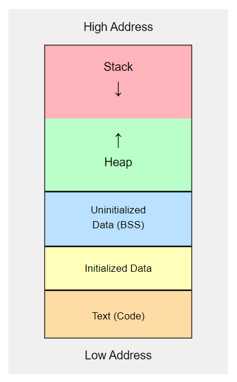

[**🏠 Home**](../README.md) | [**◀️ Structures and Unions**](../07_Structures_and_unions/structures_and_unions.md) | [**File Handling ▶️**](../09_File_handling/file_handling.md)


- ### [**08: C Memory Concepts**](#08-c-memory-concepts-1)

    - [**Memory Layout in C**](#memory-layout-in-c)
        - Segments of data in a C program and characteristics of them
    - [**Static Memory Allocation**](#static-memory-allocation)
        - Using Static memory
    - [**Dynamic Memory Allocation**](#dynamic-memory-allocation)
        - Heap memory
        - Allocating memory at runtime
        - `malloc()`, `calloc()`, `realloc()`, and `free()`
        - Dynamic arrays
    - [**Best Practices For Memory Management**](#best-practices-for-memory-management)
        - Memory leaks
        - Garbage collection in C


# **08: C Memory Concepts**

## **Memory Layout in C**

In C, the memory layout of a program typically consists of five segments:

1. **Text Segment (Code Segment)**: This is where the compiled program code resides.
2. **Initialized Data Segment**: Contains global and static variables that are initialized with non-zero values.
3. **Uninitialized Data Segment (BSS)**: Contains global and static variables that are initialized to zero or do not have explicit initialization.
4. **Heap**: Used for dynamic memory allocation.
5. **Stack**: Used for local variables and function call management.

Here's a visual representation:



## **Static Memory Allocation**

Static memory allocation occurs at compile time. The size and location of the memory are determined before the program runs. This includes:

- Global variables
- Static variables (Local and Global)
- Local variables (allocated on the stack)

Example: [example_static_memory.c](./src/example_static_memory.c)

```c
#include <stdio.h>

int global_var = 10;  // Global variable (initialized data segment)
static int static_global_var;  // Static global variable (BSS segment)

void function() {
    static int static_local_var = 0;  // Static local variable (initialized data segment)
    int local_var = 5;  // Local variable (stack)
    
    static_local_var++;
    printf("Static local variable: %d\n", static_local_var);
    printf("Local variable: %d\n", local_var);
}

int main() {
    function();
    function();
    return 0;
}
```

In this example, `global_var` and `static_local_var` are in the initialized data segment, `static_global_var` is in the BSS segment, and `local_var` is on the stack.

## **Dynamic Memory Allocation**

Dynamic memory allocation allows you to allocate memory at runtime on the heap.

### Heap Memory

The heap is a large pool of memory used for dynamic allocation. Unlike the stack, memory on the heap isn't automatically managed - you're responsible for allocating and freeing it.

### Allocating Memory at Runtime

C provides several functions for dynamic memory allocation, located in the `<stdlib.h>` header; `malloc()`, `calloc()`, `realloc()`, and `free()`

1. **`malloc()`**: Allocates a block of uninitialized memory.
2. **`calloc()`**: Allocates a block of memory and initializes it to zero.
3. **`realloc()`**: Resizes a previously allocated memory block.
4. **`free()`**: Deallocates a block of memory.

Example using `malloc()` and `free()`: [example_malloc.c](./src/example_malloc.c)

```c
#include <stdio.h>
#include <stdlib.h>

int main() {
    int *ptr;
    int n = 5;

    // Allocate memory for 5 integers
    ptr = (int*)malloc(n * sizeof(int));

    if (ptr == NULL) {
        printf("Memory allocation failed\n");
        return 1;
    }

    // Use the allocated memory
    for (int i = 0; i < n; i++) {
        ptr[i] = i + 1;
    }

    // Print the values
    for (int i = 0; i < n; i++) {
        printf("%d ", ptr[i]);
    }
    printf("\n");

    // Free the allocated memory
    free(ptr);

    return 0;
}
```

Example using `calloc()`: [example_calloc.c](./src/example_calloc.c)

```c
#include <stdio.h>
#include <stdlib.h>

int main() {
    int *ptr;
    int n = 5;

    // Allocate and initialize memory for 5 integers
    ptr = (int*)calloc(n, sizeof(int));

    if (ptr == NULL) {
        printf("Memory allocation failed\n");
        return 1;
    }

    // Print the values (should all be 0)
    for (int i = 0; i < n; i++) {
        printf("%d ", ptr[i]);
    }
    printf("\n");

    // Free the allocated memory
    free(ptr);

    return 0;
}
```

Example using `realloc()`: [example_realloc.c](./src/example_realloc.c)

```c
#include <stdio.h>
#include <stdlib.h>

int main() {
    int *ptr;
    int n = 5;

    // Allocate memory for 5 integers
    ptr = (int*)malloc(n * sizeof(int));

    if (ptr == NULL) {
        printf("Memory allocation failed\n");
        return 1;
    }

    // Initialize the array
    for (int i = 0; i < n; i++) {
        ptr[i] = i + 1;
    }

    // Resize the array to hold 10 integers
    n = 10;
    ptr = (int*)realloc(ptr, n * sizeof(int));

    if (ptr == NULL) {
        printf("Memory reallocation failed\n");
        return 1;
    }

    // Initialize the new elements
    for (int i = 5; i < n; i++) {
        ptr[i] = i + 1;
    }

    // Print all elements
    for (int i = 0; i < n; i++) {
        printf("%d ", ptr[i]);
    }
    printf("\n");

    // Free the allocated memory
    free(ptr);

    return 0;
}
```

### Dynamic Arrays

Dynamic arrays are arrays whose size can be changed at runtime. They are typically implemented using pointers and dynamic memory allocation.

Example: [example_dynamic_arrays.c](./src/example_dynamic_arrays.c)

```c
#include <stdio.h>
#include <stdlib.h>

int main() {
    int rows = 3, cols = 4;
    int **array;

    // Allocate memory for rows
    array = (int**)malloc(rows * sizeof(int*));

    // Allocate memory for each row
    for (int i = 0; i < rows; i++) {
        array[i] = (int*)malloc(cols * sizeof(int));
    }

    // Initialize the array
    for (int i = 0; i < rows; i++) {
        for (int j = 0; j < cols; j++) {
            array[i][j] = i * cols + j;
        }
    }

    // Print the array
    for (int i = 0; i < rows; i++) {
        for (int j = 0; j < cols; j++) {
            printf("%2d ", array[i][j]);
        }
        printf("\n");
    }

    // Free the allocated memory
    for (int i = 0; i < rows; i++) {
        free(array[i]);
    }
    free(array);

    return 0;
}
```

## **Best Practices for Memory Management**

1. **Always check the return value of memory allocation functions**: They return `NULL` if allocation fails.
2. **Always free dynamically allocated memory**: Failing to do so leads to memory leaks.
3. **Don't use memory after freeing it**: This can lead to undefined behavior.
4. **Avoid memory fragmentation**: Allocate larger blocks instead of many small ones when possible.
5. **Use tools like Valgrind**: These can help detect memory leaks and other memory-related issues.


### Memory Alignment

Memory alignment refers to the way data is arranged and accessed in computer memory. Proper alignment can significantly impact performance.

Example: [example_memory_allignment.c](./src/example_memory_allignment.c)

```c
#include <stdio.h>

struct Aligned {
    char c;
    int i;
    char d;
};

struct Packed {
    char c;
    int i;
    char d;
} __attribute__((packed));

int main() {
    printf("Size of Aligned: %zu\n", sizeof(struct Aligned));
    printf("Size of Packed: %zu\n", sizeof(struct Packed));
    return 0;
}
```

### Memory Leaks

Memory leaks occur when dynamically allocated memory is not freed, causing the program to consume more and more memory over time.

Example: [example_memory_leaks.c](./src/example_memory_leaks.c)

```c
#include <stdlib.h>

void memory_leak() {
    int *ptr = (int*)malloc(sizeof(int));
    // ptr is not freed before function returns
}

int main() {
    while(1) {
        memory_leak();
    }
    return 0;
}
```

To prevent this, always free dynamically allocated memory when it's no longer needed.

### Garbage Collection in C

C doesn't have built-in garbage collection, but there are third-party libraries that provide this functionality, such as the Boehm-Demers-Weiser conservative garbage collector.

Example using the Boehm GC: [example_gc.c](./src/example_gc.c)

```c
#include <stdio.h>
#include <gc.h>

int main() {
    GC_INIT();
    int *p = (int*)GC_MALLOC(sizeof(int));
    *p = 10;
    printf("%d\n", *p);
    // No need to free p
    return 0;
}
```

This lesson on C memory concepts covered memory layout, static and dynamic memory allocation, best practices, and some advanced topics. Effective memory management is crucial for writing efficient and bug-free C programs.


[**🏠 Home**](../README.md) | [**◀️ Structures and Unions**](../07_Structures_and_unions/structures_and_unions.md) | [**File Handling ▶️**](../09_File_handling/file_handling.md)